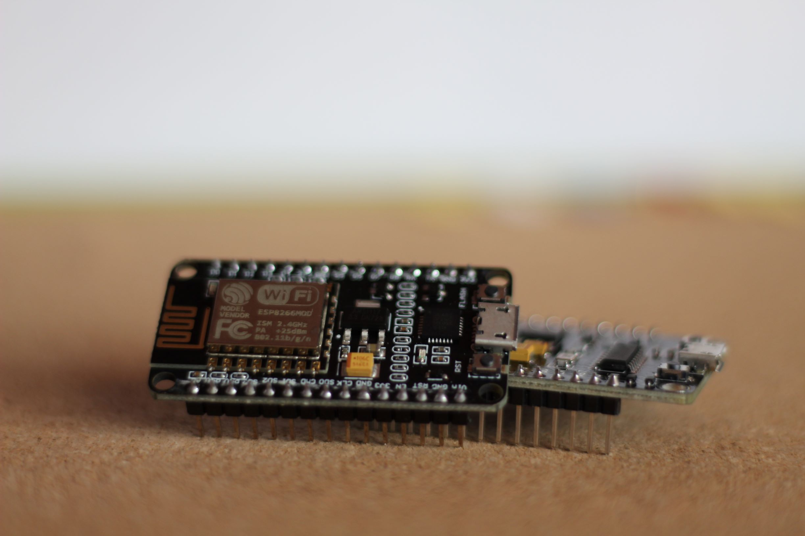
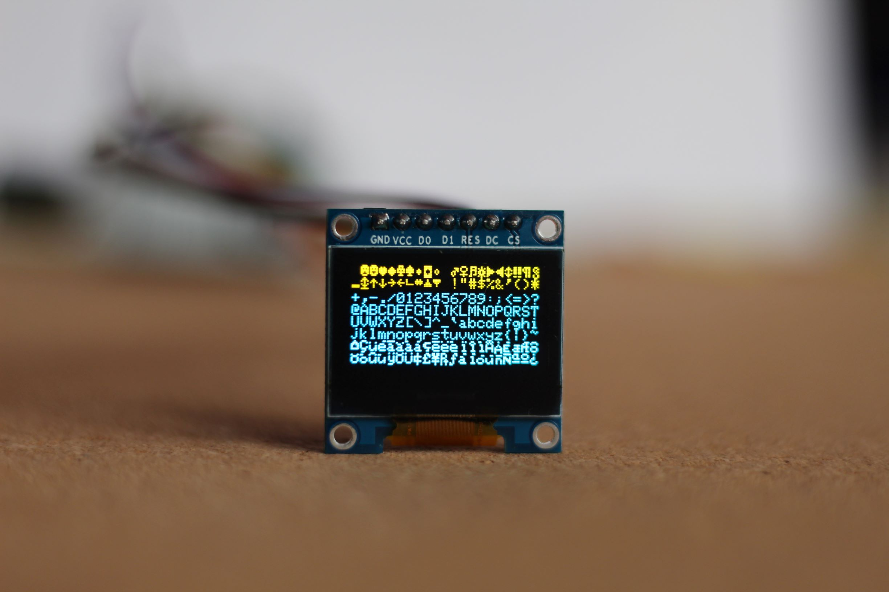
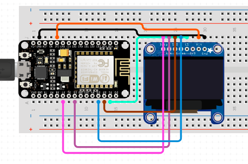

#  _Prezentare proiect_
> Crișan Ana, 333AB

[[_TOC_]]


Modulul ESP8266 oferă o soluție completă și autonomă de rețea Wi-Fi, fiind o soluție foarte bună pentru crearea unor echipamente smart home sau pentru IoT devices.
În proiectul pe care urmează să-l implementez doresc să testez capabilitățile conexiunii WiFi ale acestor module, prin conectarea acestora și trimiterea unor pachete între ele. 

## :closed_book: _Etape proiect_

Pentru realizarea acestui proiect, se vor urmări următorii pași:

- configurarea primului ESP8266 drept server

- configurarea celui de-al doilea ESP8266 drept client 

- conectarea unui display OLED la client 

- trimiterea unor date, testarea conexiunii folosind comanda ping și afisarea rezultatelor pe ecran


## :green_book: _Proiecte similare/ Biblioteci utilizate_
----


- [ESP8266 Client-Server Wi-Fi Communication Between Two Boards][link1]: acest exemplu configureaza cele doua module 
drept client si server pentru a transmite niste date. Serverul are conectat un display, iar clientul are conectat un
senzor de masurare a temperaturii, umiditatii si presiunii. Astfel, clientul prelueaza de la senzori datele necesare și
le transmite serverului pentru a putea fi ulterior afișate. 
Am ales să pornesc de la acest exemplu.
     
[link1]: https://randomnerdtutorials.com/esp8266-nodemcu-client-server-wi-fi/

- [Adafruit GFX Library][link2]: este biblioteca pe care o voi folosi pentru a afisa date pe display; aceasta are o secțiune cu mai multe exemple din care m-am inspirat

[link2]:https://github.com/adafruit/Adafruit-GFX-Library

- [ESP8266Ping][link3]: este biblioteca pe care o voi folosi pentru a calcula avg (average response time)

[link3]: https://github.com/dancol90/ESP8266Ping

## :blue_book: _Partea hardware_
Pentru proiect am utilizat următoarele componente:
- două module NodeMCU ESP8266


- ecran OLED 0.95” compatibil Arduino


- două baterii externe


#### :electric_plug: Schema electrică
Conectarea display-ului la modulul ESP8266 am făcut-o astfel:





## :orange_book: _Explicare cod_

### :speech_balloon: _**Cod server**_
----

Bibliotecile necesare crearii serverului:

```
#include <ESP8266WiFi.h>
#include "ESPAsyncWebServer.h"
```
Definire credentiale server:
```
const char* ssid = "ESP8266";
const char* password = "123456789";
```
Crearea unui server web pe portul 80:
```
AsyncWebServer server(80);
```
Setare ESP8266 drept Access Point:
```
WiFi.softAP(ssid, password);
```
### :speech_balloon: _**Cod client**_
----

Biblioteci pentru display:
```
#include <Wire.h>
#include <Adafruit_GFX.h>
#include <Adafruit_SSD1306.h>
```
Initializare display:
```
if(!display.begin(SSD1306_SWITCHCAPVCC, 0x3C)) {
    Serial.println(F("SSD1306 allocation failed"));
    for(;;); // Don't proceed, loop forever
  }
```


Exemplu afisare text pe display:
```
display.clearDisplay();
display.setTextColor(WHITE); display.setTextSize(2);
display.setCursor(0,0);
display.print("");
display.print("Acesta este un text");
display.setTextSize(1);
display.cp437(true);
display.write(248);
display.display();
```
Bibioteci pentru conexiunea WiFi si HTTP request-uri
```
#include <ESP8266WiFi.h>
#include <ESP8266HTTPClient.h>
#include <WiFiClient.h>
```
Conectare la WiFi:
```
const char* ssid = "ESP8266";
const char* password = "123456789";
WiFi.begin(ssid, password);
while(WiFi.status() != WL_CONNECTED) { 
    delay(500);
    Serial.print(".");
  }
Serial.println("");
Serial.println("Connected to WiFi");
Serial.print("Connected to WiFi network with IP Address: ");
Serial.println(WiFi.localIP());

```
Folosirea comenzii ping (sunt trimise cate 10 ping-uri o data la 5 secunde ):

```
#include <ESP8266Ping.h>
IPAddress ip(192,168,4,1);
bool ret1 = Ping.ping(ip,10);
display.print(Ping.averageTime()); // afisare timp mediu pentru raspunsul comenzii ping
```
## :ledger: _Rezultate_


Pentru a testa conexiunea WiFi, m-am folosit de comanda ping. Astfel, o dată la 5 secunde, se trimit 10 ping-uri de la client la server și se afișează timpul mediu de răspuns în milisecunde. Am facut acest lucru de mai multe ori, alegând distanțe diferite între cele două module pentru a testa cât de bună este conexiunea.
Am realizat următoarele teste:

<details><summary>:space_invader: pentru o distanță mai mică de 1m:</summary>
- cele doua module se aflau in aceeasi incapere

- average response time:

    1. 2 ms
    1. 5 ms
    1. 5 ms
    1. 4 ms
    1. 5 ms
</details>

<details><summary>:space_invader: pentru o distanță de 10m:</summary>

- cele doua module se aflau in incaperi diferite, existant mai multi pereti intre cele doua

- average response time:

    1. 4 ms
    1. 6 ms
    1. 5 ms
    1. 7 ms
    1. 6 ms
</details>

<details><summary>:space_invader: pentru o distanță de 15m:</summary>

- cele doua module se aflau in incaperi diferite, existant mai multi pereti intre cele doua

- average response time:

    1. 6 ms
    1. 6 ms
    1. 9 ms
    1. 8 ms
    1. 4 ms
    1. 7 ms
    1. 5 ms
    1. 8 ms
</details>

<details><summary>:space_invader: pentru o distanță de 20m:</summary>

- cele doua module se aflau in exterior, nu au existat pereti despartitori

- average response time:

    1. 4 ms
    1. 4 ms
    1. 8 ms
    1. 12 ms
    1. 11 ms
    1. 13 ms
    1. 11 ms
</details>

<details><summary>:space_invader: pentru o distanță de ~35m:</summary>

- cele doua module se aflau in exterior, nu au existat pereti despartitori; nu stiu care a fost distanta exacta

- average response time:

    1. 4 ms
    1. 10 ms
    1. 23 ms (aici s-a pierdut conexiunea)
    1. 15 ms
    1. 11 ms
</details>

----

#### :heavy_check_mark: _Concluzii_

Din testele efectuate, pot spune ca conexiunea intre cele doua module este una buna, in special pe distante nu mai mari de 20 de metri. Desi timpul de raspuns poate fi influentat de distanta sau de mediul exterior, cred ca diferentele de ordinul milisecundelor nu influenteaza intr-un mod negativ majoritatea aplicatiilor pentru care ar putea folosite aceste module.


 


